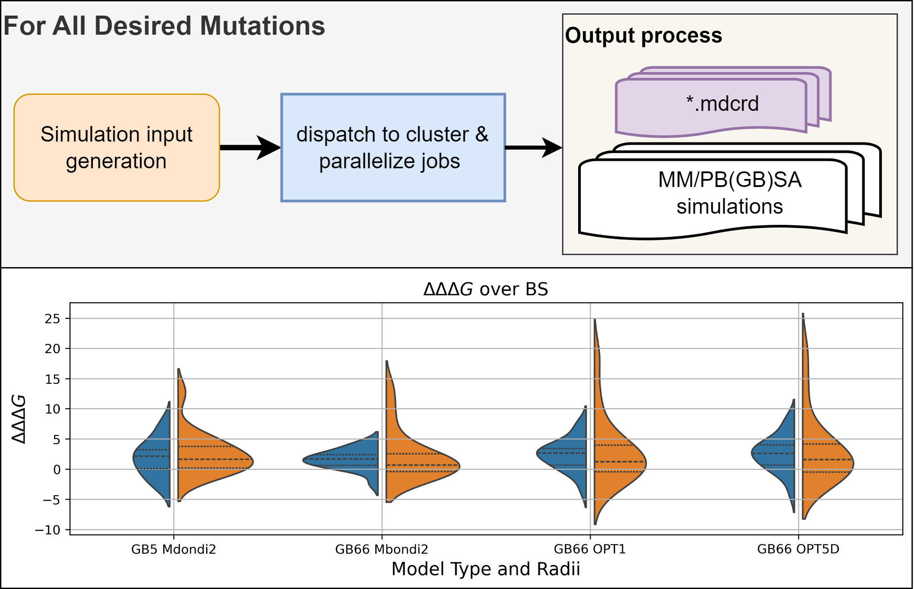

# High Throughput Mutational Scanning in Amber (HTMS-Amber)

This project presents a comprehensive pipeline for **High Throughput Mutational Scanning (HTMS)**, designed for efficient use within the **Amber molecular dynamics environment**. HTMS-Amber aims to streamline the process of calculating changes in binding free energies for a multitude of mutations by accelerating computational workflows. 

The pipeline offers robust capabilities for both:
* **Standard Alanine Scanning:** A foundational method for assessing the contribution of individual residues to protein stability and binding.
* **Non-Alanine Mutations:** Enabling more complex and biologically relevant mutational analyses by incorporating tools like MODELLER for accurate mutated PDB file generation.

More comprehensive documentation guides you through the practical aspects of implementing HTMS-Amber, covering essential setup, execution steps, and detailed explanations of its features.

*A general overview of the HTMS-Amber pipeline with its potential applications for high-throughput calculations of changes in binding free energies for multiple mutations.*

For comprehensive documentation, including detailed setup instructions, usage examples, command-line arguments, and an in-depth overview of the pipeline's capabilities, please visit our dedicated GitHub Pages site:

[**Explore the HTMS-Amber Documentation**](https://fergplace.github.io/HTMS_Amber/)